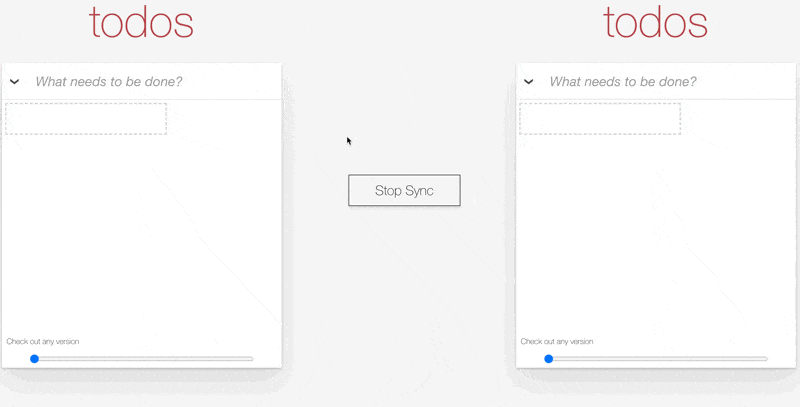

# Loro Movable Tree Demo

This project is a collaborative TodoMVC application built using Loro. 

It incorporates the concept of parent and child tasks to demonstrate the capability of combining **Movable Tree** with other basic data types. Additionally, you can use the slider located below to rewind history. 

For more information about CRDTs and local-first approaches, please visit [loro.dev](loro.dev) and join our [discord channel](https://discord.gg/tUsBSVfqzf). 

The project uses [TodoMVC](https://todomvc.com/) as a template and uses [react-sortable-tree](https://github.com/nosferatu500/react-sortable-tree) for the hierarchical UI.